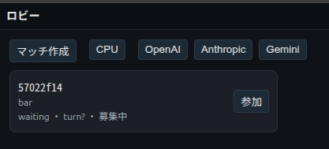
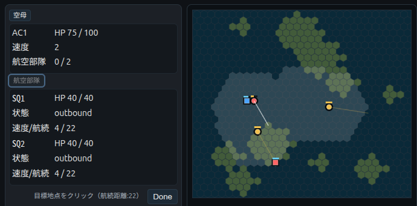

Japanese: [README_JA.md](README_JA.md)

# Naval Battle Simulation Game

This is a turn-based naval battle simulation game with simple rules and controls. Players command an aircraft carrier and launch air wings to sink the enemy carrier. It combines quick, casual matches with the strategic depth of scouting and positioning.

Game concept video:

<video src="docs/assets/carrier_war_move1.mp4"><video>

## Features
- Turn-based with simultaneous execution
- Simple combat centered on aircraft carriers and air wings
- Reconnaissance element to locate unseen enemies
- Victory condition at 30 turns (a timed strategy game)
- Two-player matches (player vs. player or player vs. AI)





## Setup

### 1. Clone the repository
```bash
git clone https://github.com/route250/carrier-war-beta.git
cd carrier-war-beta
```

### 2. Create and activate a virtual environment
```bash
python3 -m venv .venv --prompt CWB
source .venv/bin/activate
```

### 3. Install dependencies
```bash
pip install -r requirements.txt
```

### 4. Start the server
```bash
./start_server.sh start
```

### 5. Check server status
```bash
./start_server.sh status
```

### 6. Inspect logs
```bash
./start_server.sh logs
```

### Server management commands
- `./start_server.sh start` - Start the server
- `./start_server.sh stop` - Stop the server
- `./start_server.sh restart` - Restart the server
- `./start_server.sh status` - Check the server status
- `./start_server.sh logs [-f]` - Show logs (`-f` for real-time tailing)

### Changing the listen address and port

By default the server starts on `0.0.0.0:8000`, but you can change it via environment variables:

```bash
# Change port to 8080
PORT=8080 ./start_server.sh start

# Change the address to 127.0.0.1 (localhost only)
HOST=127.0.0.1 ./start_server.sh start

# Change both
HOST=192.168.1.100 PORT=3000 ./start_server.sh start
```

Alternatively, export the environment variables before running:

```bash
export HOST=127.0.0.1
export PORT=8080
./start_server.sh start
```

Once the server starts successfully, you can access the game at `http://localhost:8000`.

## API keys and environment variables (.env / config.env)

This project can use external LLM providers (OpenAI / Anthropic / Gemini). You can provide each provider's API key via environment variables or place a `config.env` (or any `.env` file) in the project root to have it loaded.

When scripts and modules start, they automatically try to load `config.env` from the project root. Example:

```text
# Example config.env (place in project root)
OPENAI_API_KEY=sk-xxxxxxxxxxxxxxxxxxxxxxxxxxxx
OPENAI_BASE_URL=            # Set when using an OpenAI-compatible proxy
ANTHROPIC_API_KEY=sk-xxxxxxxxxxxxxxxxxxxxxxxxxxxx
GEMINI_API_KEY=xxxxxxxxxxxx # Google GenAI API key
# Override default server listen address/port
HOST=0.0.0.0
PORT=8000
```

Commonly used environment variables:

- `OPENAI_API_KEY` - API key for OpenAI (or compatible APIs)
- `OPENAI_BASE_URL` - Set when using an OpenAI-compatible endpoint (proxy)
- `ANTHROPIC_API_KEY` - API key for Anthropic (Claude)
- `GEMINI_API_KEY` - API key for Google GenAI / Gemini
- `HOST`, `PORT` - Server listen address and port (referenced by `start_server.sh`)

Notes:

- API keys are sensitive. Do not commit `config.env` to the repository. It is recommended to add `config.env` to `.gitignore`.
- Modes that do not require keys (such as CPU agents) are available for testing. Only set the keys when you actually need to call external APIs.
- If you do not use `config.env`, set them in the shell (for example `export OPENAI_API_KEY=...`) before starting.
