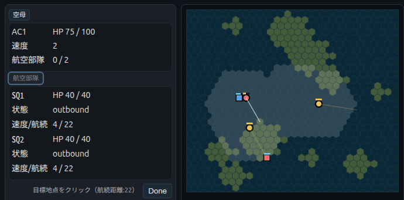

English: [README.md](README.md)

# 海戦シミュレーションゲーム

シンプルなルールと操作で遊べる、ターン制の海戦シミュレーションゲームです。
プレイヤーは空母を操作し、航空部隊を発艦させて敵空母を撃沈することを目指します。
短時間で決着がつくカジュアル性と、索敵や位置取りの戦略性を兼ね備えています。

ゲームコンセプト動画:

<video src="docs/assets/carrier_war_move1.mp4" controls loop style="max-width:30%;height:auto">
	お使いの環境で動画が再生できない場合は、docs/assets/carrier_war_move1.mp4 を参照してください。
</video>

## 特徴
- ターン制・同時進行
- 空母と航空部隊によるシンプルな戦闘
- 見えない敵を探し出す索敵要素
- 30ターンでの決着ルールあり（制限時間付きの戦略ゲーム）
- 2人対戦（プレイヤー vs プレイヤー、または プレイヤー vs AI）





## セットアップ

### 1. リポジトリのクローン
```bash
git clone https://github.com/route250/carrier-war-beta.git
cd carrier-war-beta
```

### 2. 仮想環境の作成・有効化
```bash
python3 -m venv .venv --prompt CWB
source .venv/bin/activate
```

### 3. 依存関係のインストール
```bash
pip install -r requirements.txt
```

### 4. サーバーの起動
```bash
./start_server.sh start
```

### 5. サーバーのステータス確認
```bash
./start_server.sh status
```

### 6. ログの確認
```bash
./start_server.sh logs
```

### サーバー管理コマンド
- `./start_server.sh start` - サーバーを開始
- `./start_server.sh stop` - サーバーを停止
- `./start_server.sh restart` - サーバーを再起動
- `./start_server.sh status` - サーバーの状態を確認
- `./start_server.sh logs [-f]` - ログを表示（-fでリアルタイム表示）

### listenアドレス・ポートの変更

デフォルトでは`0.0.0.0:8000`でサーバーが起動しますが、環境変数で変更できます：

```bash
# ポートを8080に変更
PORT=8080 ./start_server.sh start

# アドレスを127.0.0.1（ローカルホストのみ）に変更
HOST=127.0.0.1 ./start_server.sh start

# 両方を変更
HOST=192.168.1.100 PORT=3000 ./start_server.sh start
```

または、環境変数をエクスポートしてから実行：

```bash
export HOST=127.0.0.1
export PORT=8080
./start_server.sh start
```

サーバーが正常に起動すると、`http://localhost:8000` でゲームにアクセスできます。

## APIキーと環境変数 (.env / config.env)

このプロジェクトは外部のLLMプロバイダ（OpenAI / Anthropic / Gemini）を利用できます。
各プロバイダのAPIキーは環境変数で渡すか、プロジェクトルートに `config.env`（または任意の `.env` ファイル）を置いて読み込ませることができます。

スクリプトやモジュールは起動時にプロジェクトルートの `config.env` を自動で読み込もうとします。例：

```text
# config.env の例（プロジェクトルートに置く）
OPENAI_API_KEY=sk-xxxxxxxxxxxxxxxxxxxxxxxxxxxx
OPENAI_BASE_URL=            # OpenAI 互換プロキシを使う場合に設定
ANTHROPIC_API_KEY=sk-xxxxxxxxxxxxxxxxxxxxxxxxxxxx
GEMINI_API_KEY=xxxxxxxxxxxx # Google GenAI の API キー
# サーバー listen のデフォルトを上書きする場合
HOST=0.0.0.0
PORT=8000
```

よく使う環境変数一覧：

- `OPENAI_API_KEY` - OpenAI（または互換API）の API キー
- `OPENAI_BASE_URL` - OpenAI 互換エンドポイント（プロキシ）を使う場合に設定
- `ANTHROPIC_API_KEY` - Anthropic (Claude) の API キー
- `GEMINI_API_KEY` - Google GenAI / Gemini の API キー
- `HOST`, `PORT` - サーバーの listen アドレスとポート（`start_server.sh` で参照）

注意点：

- APIキーは機密情報です。`config.env` をリポジトリにコミットしないでください。`.gitignore` に `config.env` を追加することを推奨します。
- テスト用にキーが不要なモード（CPU エージェントなど）も用意されています。実際に外部APIを叩く機能を使う場合のみ各サービスのキーを設定してください。
- `config.env` を使わない場合は、シェルで `export OPENAI_API_KEY=...` のように設定してから起動してください。
